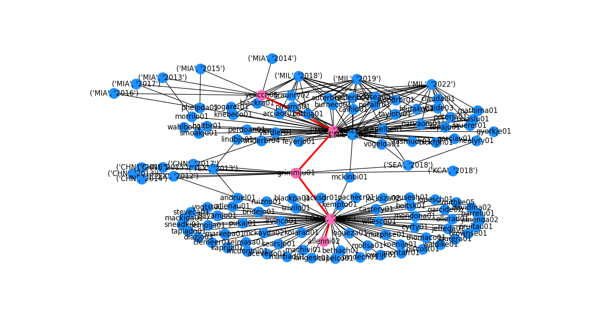

# Major League Baseball Player Network

Welcome to the Major League Baseball Player Network Project, a Python script for generating network visualizations that uncover the relationships between players and teams. By using network analysis libraries such as NetworkX and PythonDS, this project aims to provide insights into the interconnected relationship of Major League Baseball through graph visualizations of player-team-player relationships. Additionally, this project also allows users to dive deeper into the player-team-player relationships through exploring player biographies and statistics via [baseball-reference.com](https://www.baseball-reference.com).

## Getting Started
Download all of the required files from this repository:
- baseball_graph.py
- generate_baseball_graph.py
- requirements.txt

### Data
The data for this project comes from the [Sean Lahman Baseball Database](https://www.seanlahman.com/baseball-archive/statistics/). The data is included in the `data` directory and is in CSV format.

### Dependencies
- **Python3** and the corresponding packages:
    - matplotlib
    - networkx
    - pickle

### Installing
`pip install -r requirements.txt`

### Executing the program
`python3 baseball_graph.py`

### User Interaction
The Major League Baseball Network Project allows users to explore relationships between players and teams in more detail. To use this feature, run the `baseball_graph.py` script and follow these steps:

1. When prompted, enter the first and last name of a player you would like to explore. This will generate a Breadth-First Search (BFS) starting from that player to uncover their relationships with other players and teams in the MLB. A subgraph of the BFS will be displayed in a new window using matplotlib and will show the player and their first-degree connections. The nodes in the subgraph represent teams and the other players that played for those teams. The team nodes are labeled with the team id and the years the player played for that team. The player nodes are labeled with the player id.

2. Next, you will be prompted to enter the first and last name of a second player you would like to compare to the first. This will generate a graph using NetworkX that includes both players and the teams they played for, as well as the other players that played for those teams. The nodes in the graph represent teams and players, and are labeled with the team id and the years the player played for that team or with the player id. The edges between the nodes represent that the player played for the team or that they played together on the same team.

3. The graph will be displayed in a new window using matplotlib. From there, you can explore the graph further by zooming in or out, or hovering over nodes to view more information. The path between the first and second player will be highlighted in red.

4. If you would like to learn more about a specific player in the path, you can enter their name when prompted. This will open a new tab in your default web browser with the player's page on [baseball-reference.com](https://www.baseball-reference.com).

### Example Output:
```
Enter the first and last name of a player in the following format: '<Firstname> <Lastname>', or 'exit' to quit: Christian Yelich
Enter the first and last name of another player in the following format: '<Firstname> <Lastname>', or 'exit' to quit: Nick Allen
More than one Nick Allen has been found.
1: Nick Allen born in 1888
2: Nick Allen born in 1998
Please select the Nick Allen you want: 2
['Nick Allen', 'Oakland Athletics, 2022', 'Justin Grimm', 'Milwaukee Brewers, 2020', 'Christian Yelich']
1. Nick Allen
2. Justin Grimm
3. Christian Yelich
Please select the number of a player you would like more information, or 'N' to continue: N
Enter the first and last name of another player in the following format: '<Firstname> <Lastname>', or 'exit' to quit: exit
Good Bye!
```
### Christian Yelich Subgraph


### Christian Yelich to Nick Allen Graph
